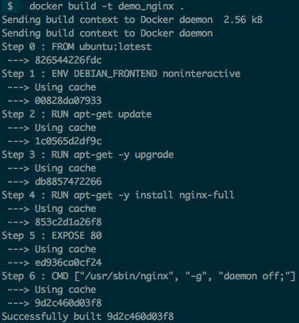

name: cover

# Docker par l'exemple

[@chadrien](https://twitter.com/chadrien), développeur [@occitech](https://twitter.com/occitech)

---

# C'est quoi Docker ?

- Conteneurs d'application

???

- Application = mysql, apache, etc.

--

- Virtualisation au niveau de l'OS

???

- Plus besoin de virtualbox, VMWare, etc.
- Seul le logiciel est virtualisé, pas le matériel

--

- Environnements isolés

???

- Grâce aux fonctionnalités de Linux

--

- Tourne sur tout Linux, soit 90% du parc mondial (source médihadrien)

???

- Par extension, nos applications tournent partout, quelle que soit la techno sur lesquelles elle repose

---

# Dans le détail

.image[]

---

# LOL NOPE!

.image[]

???

- Faîtes moi confiance, c'est cool
- RTFM!

---

# Notre premier conteneur : Nginx

```bash
FROM ubuntu:latest

ENV DEBIAN_FRONTEND noninteractive
RUN apt-get update
RUN apt-get -y upgrade

RUN apt-get -y install nginx-full

EXPOSE 80

CMD ["/usr/sbin/nginx", "-g", "daemon off;"]
```

???

- C'est par l'exemple on vous dit, du concret !
- DEBIAN_FRONTEND noninteractive parce que docker fait n'est pas
interractif (you don't say).
- apt-get -y, parce que non interractif, n'oublions pas
- "daemon off;" pour que nginx ne soit pas en daemon. Pourquoi ?
parce que Docker arrête le conteneur si le processus lancé par
s'arrête

---

# On build !

```bash
$ docker build -t demo_nginx .
```

--

Et on attend (longtemps si c'est la première fois).

--

name: build

.image[]

???

- Quand c'est fini, on run !

---

name: run

# On run !

```bash
$ docker run -P demo_nginx
```

???

- docker run -P pour dire d'exposer tous les ports spécifiés
dans le Dockerfile

--

name: run

On regarde la vie de notre beau conteneur

.small[
```bash
$ docker ps
CONTAINER ID        IMAGE                    COMMAND                CREATED             STATUS              PORTS                   NAMES
55f566619b84        demo_nginx:latest        /usr/sbin/nginx -c     3 seconds ago       Up 2 seconds        0.0.0.0:49162->80/tcp   dreamy_jones
```
]

--

name: run

Consultons l'URL `http://localhost:49162`

--

name: run

.image[

]

---

# On run !

Où se trouve le `webroot` ?

???

- -i => passage en mode interractif
- -t => on alloue un TTY

--

```bash
$ docker run -i -t demo_nginx bash
```

--

name: bash

.image[

]

---

# Partage de répertoire

On rajoute une ligne au `Dockerfile` Nginx

```bash
FROM ubuntu:latest

ENV DEBIAN_FRONTEND noninteractive

RUN apt-get update
RUN apt-get -y upgrade

RUN apt-get -y install nginx-full

* RUN rm -rf /usr/share/nginx/html

EXPOSE 80

CMD ["/usr/sbin/nginx", "-g", "daemon off;"]
```

---

# Partage de répertoire

On créé un magnifique fichier HTML

```html
<!DOCTYPE html>
<html lang="en">
<head>
    <meta charset="UTF-8">
    <title>Hello…</title>
</head>
<body>
    <h1>Hello world</h1>
</body>
</html>
```

---

# Partage de répertoire

On relance un conteneur, en liant cette fois ci les volumes !

```bash
$ docker run -P -v $(pwd):/usr/share/nginx/html demo_nginx
```

???

- $(pwd) car chemin absolu requis

--

.image[]

???

- Bon c'est cool, mais PHP dans tout ça ?

---

name: et-php

# Et PHP ?

---

# On prend les mêmes et on recommence

```bash
FROM ubuntu:latest

ENV DEBIAN_FRONTEND noninteractive
RUN apt-get update
RUN apt-get -y upgrade

RUN apt-get -y install php5-fpm
RUN sed -i 's/listen = \/var\/run\/php5-fpm.sock/listen = 9000/' /etc/php5/fpm/pool.d/www.conf

EXPOSE 9000

CMD ["/usr/sbin/php5-fpm", "-F"]
```

On build, on run… On lie !

---

# Lier les conteneurs

```bash
$ docker run -P --link tender_bardeen:fpm demo_nginx
```

`tender_bardeen` est le nom de notre conteneur php-fpm, `fpm` est son alias au sein du conteneur nginx

???

- C'est facile
- Rappel : on peut connaitre le nom d'un conteneur via `docker ps`

---

# Les variables d'environnement

Lorsque 2 conteneurs sont liés, des variables d'environnement "magiques" sont créées par Docker

--

```bash
$ docker run -P --link tender_bardeen:fpm dmo_nginx env
PATH=/usr/local/sbin:/usr/local/bin:/usr/sbin:/usr/bin:/sbin:/bin
HOSTNAME=aab51d231030
* FPM_PORT=tcp://172.17.0.32:9000
* FPM_PORT_9000_TCP=tcp://172.17.0.32:9000
* FPM_PORT_9000_TCP_ADDR=172.17.0.32
* FPM_PORT_9000_TCP_PORT=9000
* FPM_PORT_9000_TCP_PROTO=tcp
* FPM_NAME=/thirsty_elion/fpm
* FPM_ENV_DEBIAN_FRONTEND=noninteractive
HOME=/
DEBIAN_FRONTEND=noninteractive
```

---

# On fait tout marcher ensemble

On modifie encore notre `Dockerfile` Nginx

```bash
FROM ubuntu:latest

ENV DEBIAN_FRONTEND noninteractive

RUN apt-get update
RUN apt-get -y upgrade

RUN apt-get -y install nginx-full

RUN rm -rf /usr/share/nginx/html
* RUN rm /etc/nginx/sites-available/default
* ADD ./default /etc/nginx/sites-available/default

* ADD ./init.sh /init.sh
* RUN chmod +x /init.sh

EXPOSE 80

CMD ["/usr/sbin/nginx", "-g", "daemon off;"]

* ENTRYPOINT ["/init.sh"]
```

???

- ENTRYPOINT : son nom parle, il s'agit d'une commande initiale,
à laquelle CMD sera passé en paramètre
ENTRYPOINT sert de bootstrap

---

# On fait tout marcher ensemble

`default`

```bash
server {
    listen 80;

    server_name localhost;

    root /usr/share/nginx/html;
    index index.php;

    location / {
        include fastcgi_params;
        fastcgi_param SCRIPT_FILENAME $document_root$fastcgi_script_name;
        fastcgi_index index.php;
        fastcgi_pass 127.0.0.1:9000;
    }
}
```

---

# On fait tout marcher ensemble

`init.sh`

```bash
#!/usr/bin/env bash

sed -i "s/fastcgi_pass .*:.*;/fastcgi_pass $FPM_PORT_9000_TCP_ADDR:$FPM_PORT_9000_TCP_PORT;/" /etc/nginx/sites-available/default

exec "$@"
```

???

- Un exemple d'utilisation des variables d'environnement

--

`index.php`

```php
<?php

phpinfo();
```

---

# Le bouquet final

```bash
$ docker run -P -v $(pwd):/usr/share/nginx/html -d --name demo_fpm demo_fpm
$ docker run -P -v $(pwd):/usr/share/nginx/html -d --link fpm:fpm --name demo_nginx demo_nginx
```

???

- Obligation de partager notre répertoire au conteneur fpm car php-fpm doit
pouvoir lire les fichiers les fichiers php se son côté également

--

name: final

.image[]
.win[]

---

# Pour aller plus loin

- [fig](http://fig.sh)

--

- [https://github.com/docker/docker/pull/8062](https://github.com/docker/docker/pull/8062)

--

- [https://registry.hub.docker.com/](https://registry.hub.docker.com/)

???

- nginx officiel plutôt que build à la main

---

name: et-php

# GOING LIVE!

Démo avec Magento

---

name: et-php

# Merci !

[](https://twitter.com/chadrien) [](https://github.com/chadrien)
