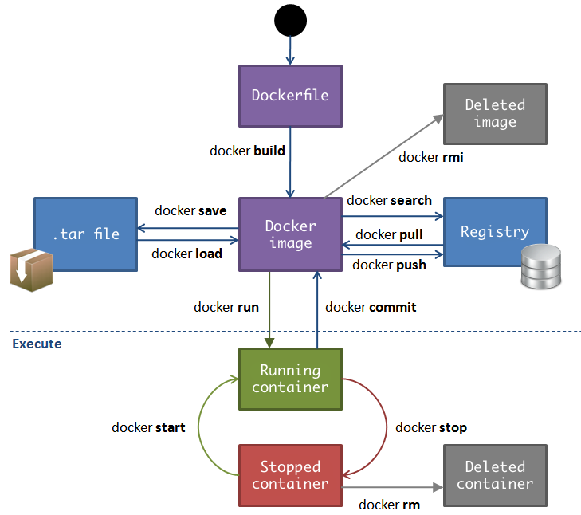
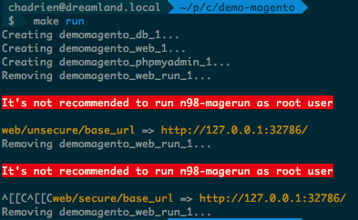
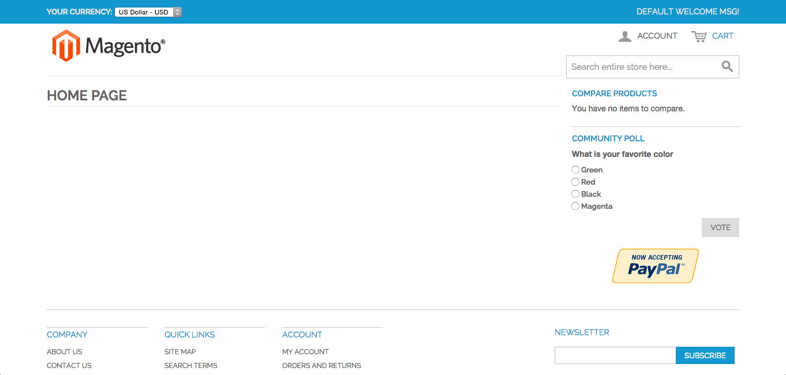
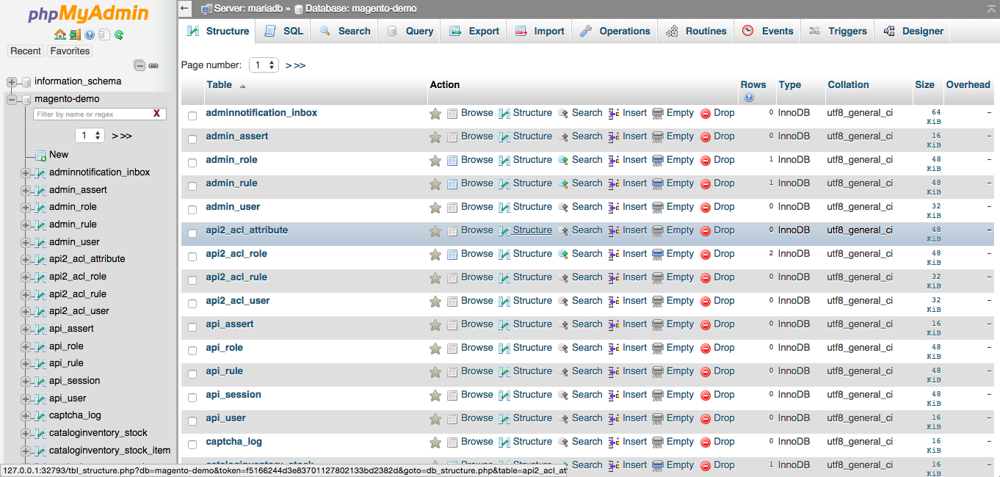
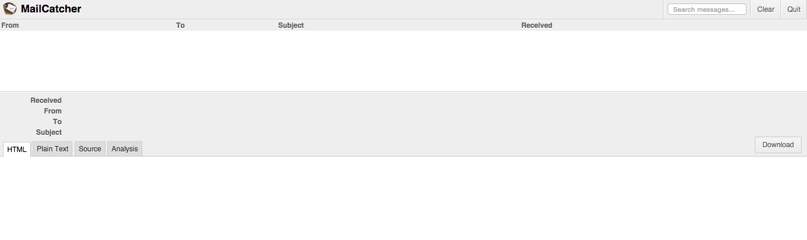
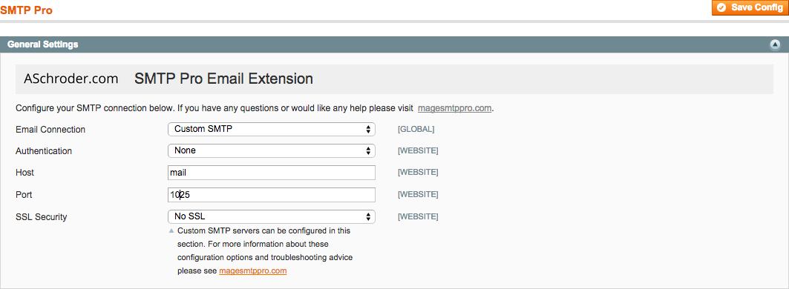
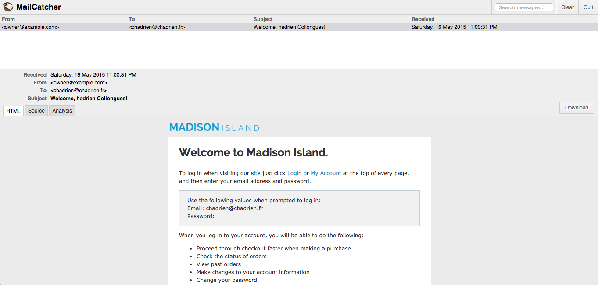

name: cover

# Magento and Docker : it’s a kind of magic


[@chadrien](https://twitter.com/chadrien)

---
name: center-title

# What is Docker?

--
name: big-font

- Application container(s)

--
name: big-font

- OS level virtualization

--
name: big-font

- Isolated environments

--
name: big-font

- Run on any GNU/Linux distribution

---
name: center-title

# Faster and simpler

---
name: image-wide


---
name: center-title

# Image vs Container

---
name: center-title

# Docker life cycle

---
name: image



---
name: center-title

# Why do I use Docker?

---
name: center-title

# How do I use Docker?

---
name: center-title

# What about Magento?

---

```yaml
db:
    image: mysql
    environment:
        MYSQL_ROOT_PASSWORD: ffe72ec7dea4ea12439f
        MYSQL_DATABASE: magento-demo
        MYSQL_USER: magento-demo
        MYSQL_PASSWORD: ce1d24b8e7e7ab46b0c2

web:
    image: occitech/magento:php5.5-apache
    ports:
        - 80
    links:
        - db
    volumes:
        - .:/var/www
```

```shell
$ docker-compose run --rm web bash -c 'n98-magerun local-config:generate db $DB_ENV_MYSQL_USER $DB_ENV_MYSQL_PASSWORD $DB_ENV_MYSQL_DATABASE files admin'
$ make run
```

---
name: image-wide



---
name: image-wide



---

```yaml
db:
    image: mysql
    environment:
        MYSQL_ROOT_PASSWORD: ffe72ec7dea4ea12439f
        MYSQL_DATABASE: magento-demo
        MYSQL_USER: magento-demo
        MYSQL_PASSWORD: ce1d24b8e7e7ab46b0c2

web:
    image: occitech/magento:php5.5-apache
    ports:
        - 80
    links:
        - db
    volumes:
        - .:/var/www

phpmyadmin:
    image: maxexcloo/phpmyadmin
    ports:
        - 80
    links:
        - db:mariadb
```

```shell
$ make run
$ make open container=phpmyadmin port=80
```

---
name: image-wide



---

```yaml
db:
    image: mysql
    environment:
        MYSQL_ROOT_PASSWORD: ffe72ec7dea4ea12439f
        MYSQL_DATABASE: magento-demo
        MYSQL_USER: magento-demo
        MYSQL_PASSWORD: ce1d24b8e7e7ab46b0c2

web:
    image: occitech/magento:php5.5-apache
    ports:
        - 80
    links:
        - db
        - mail
    volumes:
        - .:/var/www

phpmyadmin:
    image: maxexcloo/phpmyadmin
    ports:
        - 80
    links:
        - db:mariadb

mail:
    image: chadrien/mailcatcher:0.5.12
    ports:
        - 1080
```

---

```shell
$ composer require --dev "aschroder/smtp_pro=2.0.5"
$ make open container=mail port=1080
```





---
name: image-wide



---
name: center-title

# Conclusion

---
name: center-title

# Thank you
