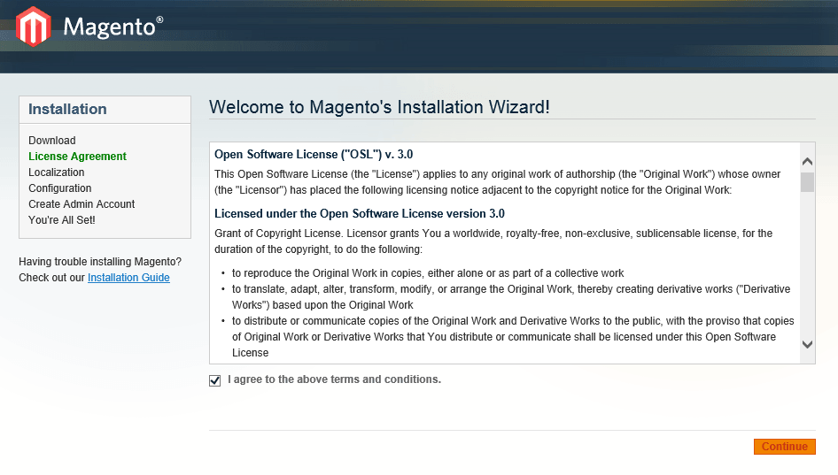

name: cover

# Magento sous Docker : it’s a kind of magic


[@chadrien](https://twitter.com/chadrien)

---
name: center-title

# C'est quoi docker ?

--
name: big-font

- Conteneurs d'application
- Virtualisation au niveau de l'OS
- Environnements isolés
- Tourne sur tout Linux, soit 90% du parc mondial (source médihadrien)

---
name: center-title

# Comment ça marche ?

---
name: nabila


---

name: center-title

# Et ça intéresse qui ?

???

- Quelques petites boîtes

--
name: brand-logos


???

- OVH : mutualisé
- Microsoft veut que ça tourne sous windows server
- Dell et AWS : offre de cloud
- Bref, si t'es développeur et que tu n'utilises pas encore Docker…

---
name: nabila


???

- … c'est comme si t'es une fille et t'as pas de shampoing !

---
name: center-title

# Je m'en sers pour quoi ?

--
name: big-font

- Pour partager un environnement de développement identique entre tous les dévelopeurs
- Pour remplacer Vagrant/Virtualbox
- Pour avoir un environnement de dev qui ressemble __pour de vrai__ à la prod

???

- Vagrant c'était bien, Docker c'est mieux
- Là où Vagrant cherchait à imiter l'environnement de production, Docker veut
briser cette séparation dev/prod, il n'y a un plus qu'un environnement propre
à vos applications
- Docker ne permet pas la modification à l'arrache des environnement, en principe
on met fin au "je comprends pas, ça marche sur ma machine"

---
name: center-title

# Je m'en sers comment ?

--
name: bigger-font

Avec [fig](http://fig.sh)

???

- Écrit en python par une boîte indépendente au projet Docker
- Racheté par Docker, c'est une forme d'adoubement, jettez-vous dessus

---
name: bigger-font

# Je m'en sers comment ?

En découplant mes services

???

- Ça tombe bien, c'est la mode, tout le monde en parle
- Un meilleur découplage implique ensuite une meilleure scalabilité, la possibilité
de remplacer des parties de l'infrastructure générale avec un minimum d'impact,
bref que du bon

---
name: center-title

# Et Magento dans tout ça ?

--

Prédicat : mon Magento se trouve dans un sous-dosser `htdocs`

--

```yaml
web:
  image: occitech/magento:php5.5-apache
  ports:
    - 80
  links:
    - db
  volumes:
    - ".:/var/www"

db:
  image: mysql
  environment:
    MYSQL_ROOT_PASSWORD: "root"
```

--

```bash
$ fig up -d
$ open http://127.0.0.1:$(docker port $(fig ps -q web) 80)
```

---
name: setup



---
name: center-title

# Merci
