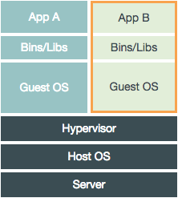
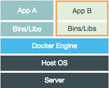
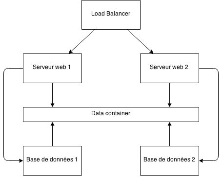
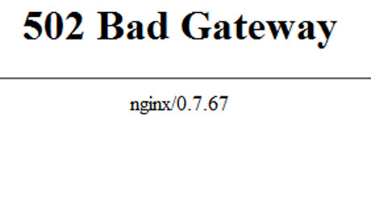
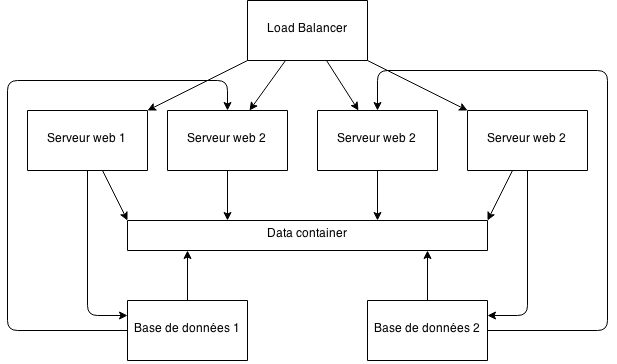
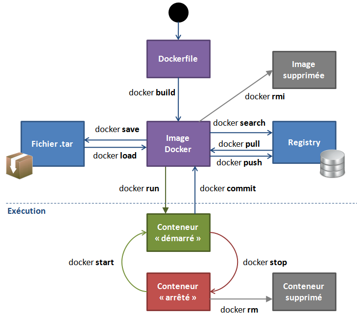
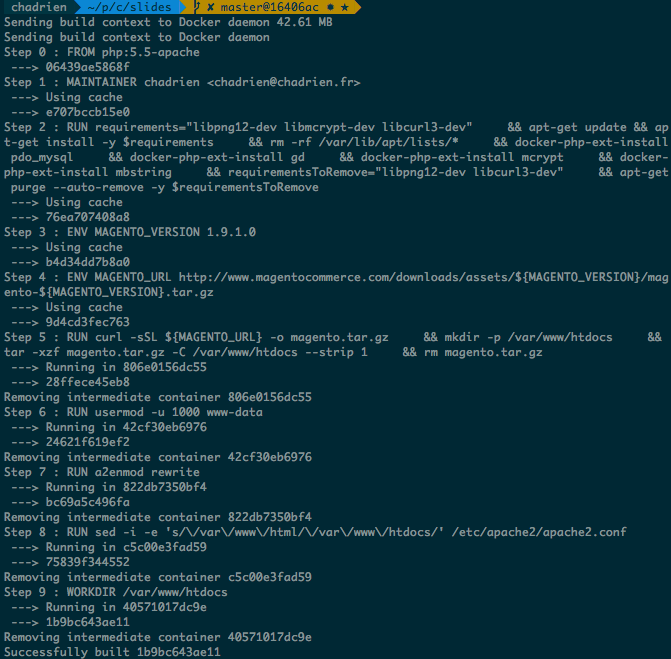
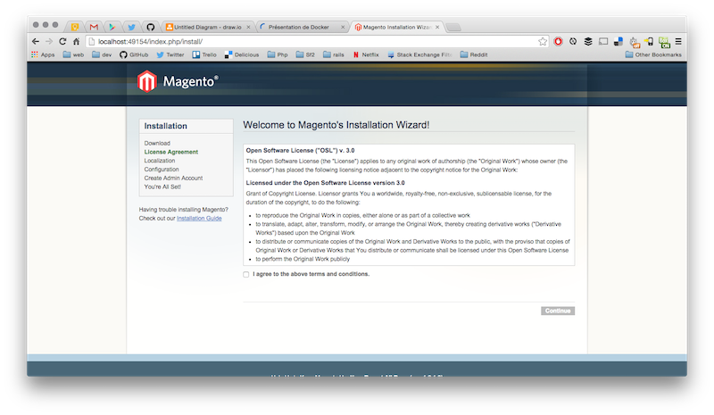

name: cover

# Présentation de Docker

La virtualisation de demain

[@chadrien](https://twitter.com/chadrien)

???

- Pourquoi Docker ?
- Environnement de développment
- À l'avenir, environnement de prod ?

---
name: center-title

# C'est quoi Docker ?

--

- Conteneurs d'application

???

- Application = mysql, apache, etc.

--

- Virtualisation au niveau de l'OS

???

- Plus besoin de virtualbox, VMWare, etc.
- Seul le logiciel est virtualisé, pas le matériel

--

- Environnements isolés

???

- Grâce aux fonctionnalités de Linux

--

- Tourne sur tout Linux, soit 90% du parc mondial (source médihadrien)

???

- Par extension, nos applications tournent partout, quelle que soit la techno sur lesquelles elle repose

---
name: center-title

# Qu'y gagne-t-on ?

--

- Partager un environnement de développement unique

???

- Fini les "ça marchait sur ma machine"

--

- Des performances

???

- On va voir juste après lesquelles et comment

--

- S'assurer que la prod marche toujours

???

- À terme le but est de déployer son environnement Docker sur la production, et
donc être assuré qu'on ne recontrera pas de problème lié au logiciel (autre que
son propre code) en prod.
- Bref, qu'y gagne-t-on ?

---
name: center-title

# Productivité

---
name: center-title

# Qui ça intéresse ?

--
name: brands-logos


???

- Mutualisé sous Docker
- RunAbove

--
name: brands-logos


???

- On veut Docker !

--
name: brands-logos


--
name: brands-logos


???

- Bref t'utilises pas Docker en 2014…

---
name: nabila


???

- … c'est comme si t'es une fille et t'as pas de shampoing !

---
name: center-title

# Comment ça marche ?

--
name: versus




???

- LXC : depuis 2006
- Plus de Guest OS : gain de Go
- Uniquement les libs et bin de l'app
- LXC fork le noyau Linux et exécute les bin dans un espace isolé
- En utilisant directement le noyau de l'hôte sans passer pas un hyperviser, on
gagne en perf
- On peut faire tourner n'importe quel GNU/Linux dans la machine virtuelle
(vrai dans 99.99% des cas, tant que ça reste compatible avec le noyau hôte)
- On peut s'en servir en prod
- Bref c'est mieux que Virtualbox/Vagrant/VMWare

---
name: center-title

# Comment s'en servir ?

???

D'abord en principe, ensuite en pratique

---
name: center-title

# Microservices FTW

--
name: big-text

Une architecture orienté service, découplée et avec un contexts limité.

???

- C'est petit
- C'est indépendant
- Il doit en savoir un minimum sur les autres services qui l'entourent. Cf. DDD
par Eric Evans
- On peut appliquer ce principe à une architecture serveur

---
name: center

# Microservices FTW



???

Que se passe-t-il si votre client passe tout à coup à la télé ?

---
name: center

# Microservices FTW



???

Le client vous appelle et là…

---
name: center

# Microservices FTW


---
name: center

# Microservices FTW



---
name: center-title

# Scalabilité

---
name: center-title

# Concrètement

--
name: docker-cycle



---
name: center-title

# Un exemple

--
name: end

avec Magento

???

- Apache + MySQL

---
name: center-title

# MySQL

--

Simple as fuck 

???

- Il y a une image officielle pour ça

--

```bash
docker run --name magento_mysql -d -e MYSQL_ROOT_PASSWORD="root" -e MYSQL_DATABASE="magento" mysql
```

--

```bash
docker ps
CONTAINER ID        IMAGE               COMMAND
0c5c529775b0        mysql:5             /entrypoint.sh mysq
CREATED             STATUS              PORTS
4 seconds ago       Up 2 seconds        3306/tcp
NAMES
magento_mysql
```

---
name: center-title

# Apache

--
name: end

Besoin d'Apache/PHP avec les pré-requis pour Magento

???

- pdo_mysql
- gd
- mcrypt
- mbstring

---
name: center-long-title

# Notre premier Dockerfile

---
name: build-image

```bash
FROM php:5.5-apache
MAINTAINER chadrien <chadrien@chadrien.fr>
```

---
name: build-image

```bash
FROM php:5.5-apache
MAINTAINER chadrien <chadrien@chadrien.fr>

RUN requirements="libpng12-dev libmcrypt-dev libcurl3-dev" \
    && apt-get update && apt-get install -y $requirements \
    && rm -rf /var/lib/apt/lists/* \
    && docker-php-ext-install pdo_mysql \
    && docker-php-ext-install gd \
    && docker-php-ext-install mcrypt \
    && docker-php-ext-install mbstring \
    && requirementsToRemove="libpng12-dev libcurl3-dev" \
    && apt-get purge --auto-remove -y $requirementsToRemove
```

???

- On en profite pour voir une bonne pratique des Dockerfile

---
name: build-image

```bash
FROM php:5.5-apache
MAINTAINER chadrien <chadrien@chadrien.fr>

RUN requirements="libpng12-dev libmcrypt-dev libcurl3-dev" \
    && apt-get update && apt-get install -y $requirements \
    && rm -rf /var/lib/apt/lists/* \
    && docker-php-ext-install pdo_mysql \
    && docker-php-ext-install gd \
    && docker-php-ext-install mcrypt \
    && docker-php-ext-install mbstring \
    && requirementsToRemove="libpng12-dev libcurl3-dev" \
    && apt-get purge --auto-remove -y $requirementsToRemove

ENV MAGENTO_VERSION 1.9.1.0
ENV MAGENTO_URL http://www.magentocommerce.com/downloads/assets/${MAGENTO_VERSION}/magento-${MAGENTO_VERSION}.tar.gz

RUN curl -sSL ${MAGENTO_URL} -o magento.tar.gz \
    && mkdir -p /var/www/htdocs \
    && tar -xzf magento.tar.gz -C /var/www/htdocs --strip 1 \
    && rm magento.tar.gz
```

---
name: build-image

```bash
FROM php:5.5-apache
MAINTAINER chadrien <chadrien@chadrien.fr>

RUN requirements="libpng12-dev libmcrypt-dev libcurl3-dev" \
    && apt-get update && apt-get install -y $requirements \
    && rm -rf /var/lib/apt/lists/* \
    && docker-php-ext-install pdo_mysql \
    && docker-php-ext-install gd \
    && docker-php-ext-install mcrypt \
    && docker-php-ext-install mbstring \
    && requirementsToRemove="libpng12-dev libcurl3-dev" \
    && apt-get purge --auto-remove -y $requirementsToRemove

ENV MAGENTO_VERSION 1.9.1.0
ENV MAGENTO_URL http://www.magentocommerce.com/downloads/assets/${MAGENTO_VERSION}/magento-${MAGENTO_VERSION}.tar.gz

RUN curl -sSL ${MAGENTO_URL} -o magento.tar.gz \
    && mkdir -p /var/www/htdocs \
    && tar -xzf magento.tar.gz -C /var/www/htdocs --strip 1 \
    && rm magento.tar.gz

RUN usermod -u 1000 www-data

RUN a2enmod rewrite

RUN sed -i -e 's/\/var\/www\/html/\/var\/www\/htdocs/' /etc/apache2/apache2.conf
WORKDIR /var/www/htdocs
```

???

Les instructions qu'on ne voit pas ici :

- EXPOSE
- RUN

---
name: center-title

# On génère l'image

--

```bash
docker build --rm -t digitalplace/magento:5.5-apache .
```

???

- Et on attend… longtemps si c'est la première fois

---
name: build-image



???

- Exécuté avec `-q` pour ne pas être trop polué
- On voit bien comment les images sont générées à partir d'un Dockerfile : cycle
`docker run`, `docker commit`, `docker rm`

---
name: center-title

# Avant de continuer

???

- Il nous faut voir un autre concept

---
name: center-title

# Lier des conteneurs

???

- Permet de faire communiquer des conteneurs entre eux

--

```bash
docker run --rm -it --link=magento_mysql:db debian env
PATH=/usr/local/sbin:/usr/local/bin:/usr/sbin:/usr/bin:/sbin:/bin
HOSTNAME=35b532637364
TERM=xterm
DB_PORT=tcp://172.17.0.2:3306
DB_PORT_3306_TCP=tcp://172.17.0.2:3306
DB_PORT_3306_TCP_ADDR=172.17.0.2
DB_PORT_3306_TCP_PORT=3306
DB_PORT_3306_TCP_PROTO=tcp
DB_NAME=/lonely_wozniak/db
DB_ENV_MYSQL_ROOT_PASSWORD=root
DB_ENV_MYSQL_DATABASE=magento
DB_ENV_MYSQL_MAJOR=5.6
DB_ENV_MYSQL_VERSION=5.6.21
HOME=/root
```

???

- Le conteneur lié est aussi mis dans le `/etc/hosts`

---
name: center-title

# Reprennons

--

```bash
docker ps
CONTAINER ID        IMAGE               COMMAND
0c5c529775b0        mysql:5             /entrypoint.sh mysq
CREATED             STATUS              PORTS
4 seconds ago       Up 2 seconds        3306/tcp
NAMES
magento_mysql
```

---

# Reprennons

```bash
docker run --name magento_web -d -p 80 --link magento_mysql:db digitalplace/magento:5.5-apache
docker ps
CONTAINER ID        IMAGE
53cec7883dcb        digitalplace/magento:5.5-apache
0c5c529775b0        mysql:5
COMMAND                  CREATED         STATUS
apache2 -DFOREGROUN      4 days ago      Up 11 minutes
/entrypoint.sh mysq      11 seconds ago      Up 11 seconds
PORTS                      NAMES
3306/tcp                   magento_web
0.0.0.0:49155->80/tcp      magento_mysql

```

---
name: center



---

name: end

# Merci !

[](https://twitter.com/chadrien) [](https://github.com/chadrien)
